# Marina


Este proyecto trata sobre como crear un [ordenador](https://es.wikipedia.org/wiki/Computadora) de 8bits, que cumpla los requisitos de una [máquina de Turing](https://es.wikipedia.org/wiki/M%C3%A1quina_de_Turing):

* Leer/Escribir caracteres de una memoria
* Poder moverse por esa memoria
* Actuar en base a unos estados definidos

Una vez nuestro ordenador cumpla todos estos requisitos, estaremos seguros de que podra ejecutar cualquier algoritmo de computación.

Todo esto inspirado por la serie de videos de [Ben Eater](https://www.youtube.com/watch?v=HyznrdDSSGM&list=PLowKtXNTBypGqImE405J2565dvjafglHU), y contado por [mí](https://twitter.com/F_de_Fornell).

## Problema

Queremos hacer un ordenador así que necesitaremos resolver estas cuestiones:

1. ¿Dónde lo vamos a montar?
2. ¿Qué diseño tendrá el circuito?
3. ¿Cuál es la base teórica detrás de los ordenadores?
4. ¿Qué componentes necesitamos para la parte practica?
5. ¿Cómo se programa?

## Soluciones

### 1º Cuestión:

Para crear el circuito de nuestro ordenador usaremos un programa de simulación de circuitos, en este caso yo he elegido [logisim-evolution](https://github.com/logisim-evolution/logisim-evolution), pero se puede utilizar otro si lo queréis.

### 2º Cuestión:

A la hora de elegir que forma tendrá el circuito se abren una infinidad de diseños, pero en lo personal prefiero usar uno basado en un BUS. Más concretamente el patrón [SAP](https://es.wikipedia.org/wiki/Simple-As-Possible_computer).

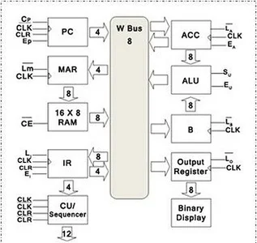

### 3º Cuestión:

Estamos siguiendo los pasos para crear un ordenador, pero. ¿Qué es un ordenador?, pues según Wikipedia es: `una máquina electrónica digital programable que ejecuta una serie de comandos para procesar los datos de entrada, obteniendo convenientemente información que posteriormente se envía a las unidades de salida`. Y eso es cierto, pero lo que yo quiero es la definición de su modelo teórico fundamental, la máquina de Turing.

#### ¿Qué es la máquina de Turing?

Es un dispositivo que manipula símbolos sobre una tira de cinta de acuerdo con una tabla de reglas.

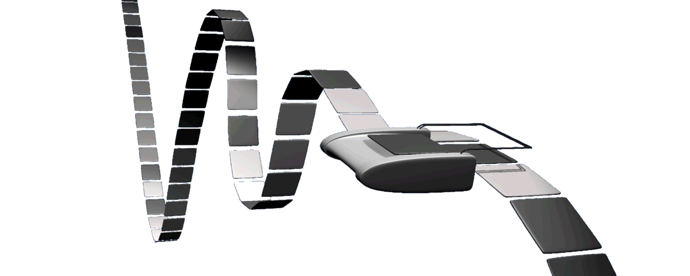

Un ejemplo visual con una tabla sencilla, para que se entienda mejor:

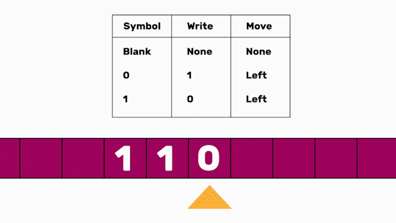

Y ahora con una tabla más compleja:

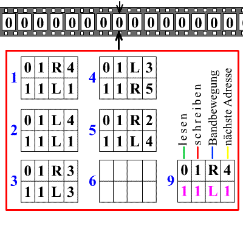

Simple ¿no?, pues solo con estas mecánicas tan sencillas se puede ejecutar cualquier algoritmo de computación. Y la verdad, suena a que es mentira o imposible, pero no lo es:

En términos generales, lo que hace la máquina es leer datos de una memoria y actuar en base a ellos siguiendo unas instrucciones predefinidas. ¿No os suena familiar?, es como programar un ordenador, este también manipula una memoria siguiendo unas instrucciones/estados que le hemos dado.

Ahora, con todo este contexto, podemos decir que:

* Sabemos que es y que hace la máquina de Turing
* Que un ordenador moderno no es más que una máquina de Turing extremadamente compleja que funciona con circuitos electrónicos

### 4º Cuestión:

Ahora, para llevar a cabo su construcción necesitaremos los siguientes componentes:

#### `CLOCK`

Manda una señal para sincronizar a todos los componentes del ordenador.

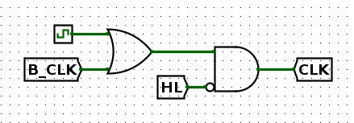

#### `PROGRAM COUNTER`

Es un registro que guarda un número que puede incrementar y decrementar, para moverse por las direcciones de la memoria. Se utiliza para saber el cauce de la ejecución.

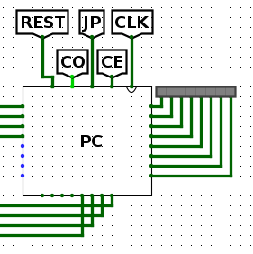

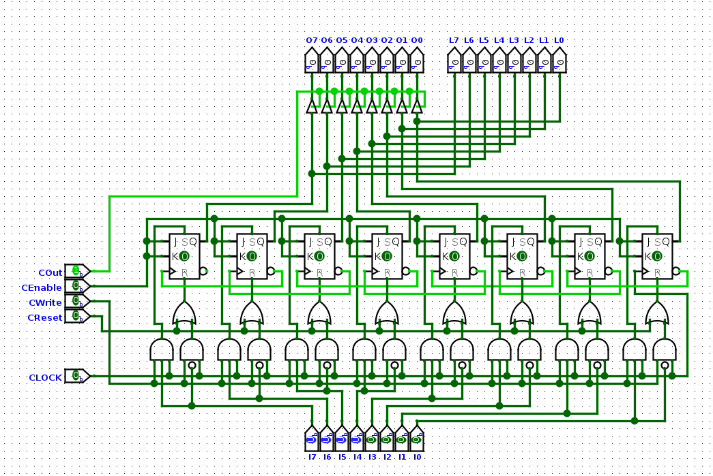

#### `MAR`

Es el registro de dirección de la memoria, almacena un número de 4bits y lo decodifica en 16 direcciones de memoria posibles. Para usarlo como dirección actual de la memoria.

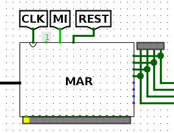

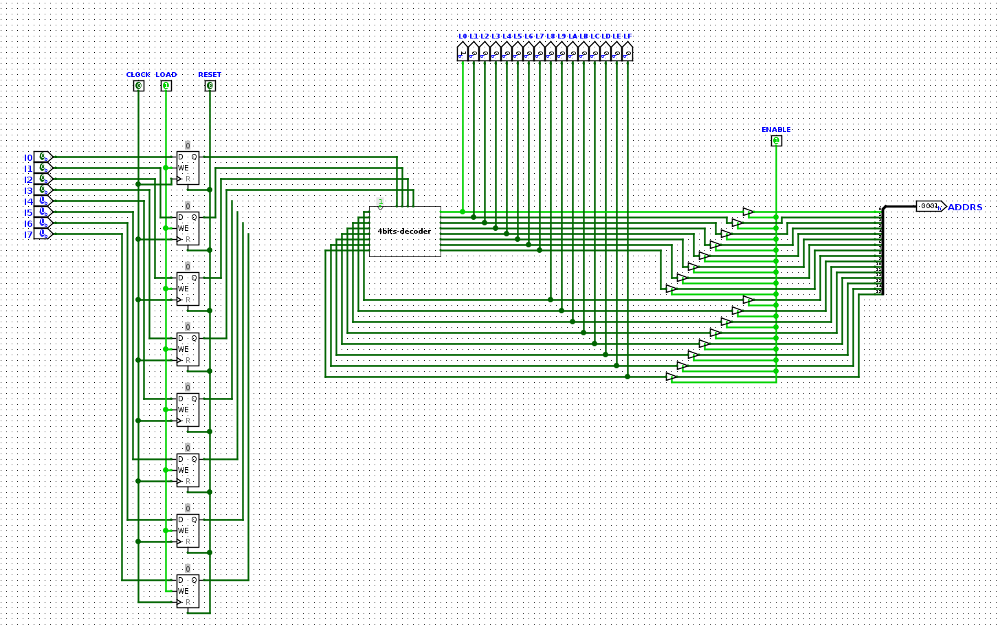

#### `RAM`

Es la memoria principal del ordenador, guarda los datos/instrucciones que ejecuta el ordenador.

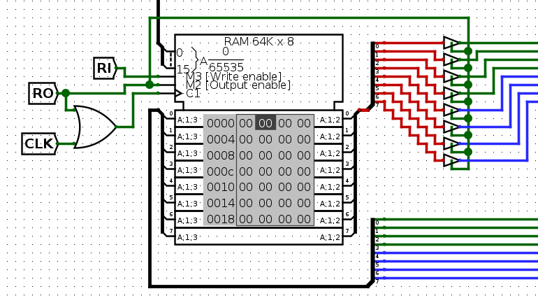

#### `REGISTRO A`

Almacena el número al que la ALU suma o resta otro número.

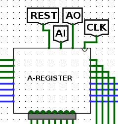


#### `REGISTRO B`

Almacena el número que la ALU suma o resta al REGISTRO A.

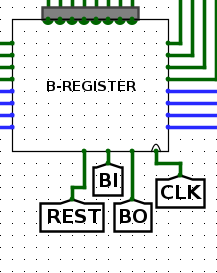


#### `ALU`

Es la encargada de hacer las operaciones aritméticas(+,-), con los REGISTROS A y B.

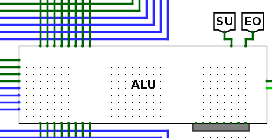

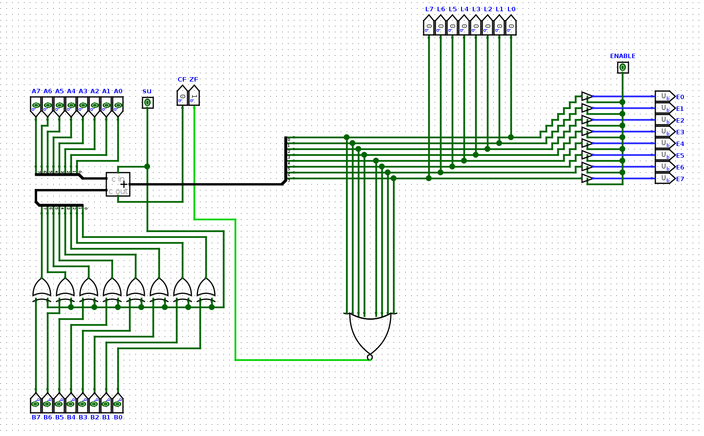

#### `FLAGS REGISTER`

Es el registro que almacena el estado de la última operación de la ALU, si el resultado anterior acarreo un 1 activa la CARRING FLAG o si el resultado fue 0 activa la ZERO FLAG.

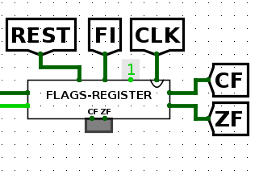


#### `REGISTRO DE INSTRUCCIONES`

Es el registro que guarda la instrucción a ejecutar, para pasársela al decodificador de instrucciones.

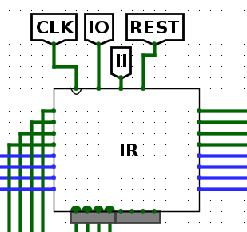


#### `DECODIFICADOR DE INSTRUCCIONES`

Es el encargado de decodificar las instrucciones programadas en la RAM para que el ordenador ejecute las acciones necesarias para que esa instrucción se lleve a cabo.

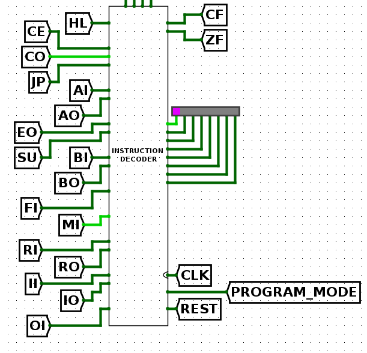

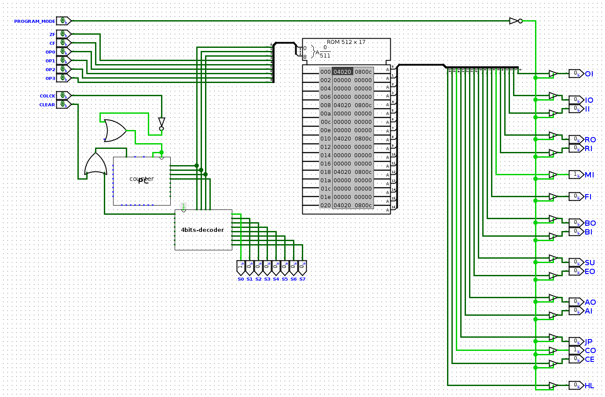

#### `BUS`

Son unos cables a los que se le conectan todos los componentes del ordenador, para comunicarse entre sí.

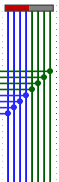

### 5º Cuestión:

Vale ahora sí, la pieza final para entender como funciona un ordenador es entender cómo es que es programable, porque al fin y al cabo, ¿cómo hacemos que el ordenador ejecute las instrucciones que le damos?. Por ejemplo, un programa que suma 2 más 2 y muestra el resultado:

```
LDA 15
ADD 15
OUT
```

Lo que he hecho aquí es cargar en el registro A lo que halla en la dirección de memoria 15, en este caso un 2, después le he sumado al registro A otra vez el valor de la dirección de memoria 15 y he mostrado el resultado.

#### ¿CÓMO?, pues asi:

Cogemos y por cada instrucción que pueda interpretar el ordenador, la rompemos en acciones que pueden hacer los componentes del ordenador, que son estas:

HL CE CO JP AI AO EO SU BI BO FI MI RI RO II IO	OI

Estos son los microcódigos, con los que nos referimos a acciones como:

* HL: Parar el reloj
* AI: Meter en el registro A lo que haya en el BUS
* CO: Volcar lo que tiene el PC en el BUS

Vale, pues vamos a desmontar la siguiente instrucción.

#### ``LDA 15``

1. CO MI
2. RO II
3. CE
4. IO MI
5. RO AI

CO volcamos en el BUS la dirección actual del PC y lo metemos en el MAR para ir a esa dirección de memoria.

RO volcamos lo que hay en esa posición de la RAM y lo metemos en el registro de instrucciones.

CE el PC aumenta el contador, para que la próxima vez que hagamos un CO sé la siguiente dirección de memoria.

IO volcamos lo que hay en el registro de instrucciones en el BUS, pero este registro solo saca los 4bits que corresponde a la dirección 15 indicada en la instrucción. MI para ir a esa dirección de memoria.

RO sacamos el valor que haya en esa posición de la RAM y lo metemos en el registro A.

Y así con cada instrucción que tenga nuestra máquina. Aquí podéis ver las instrucciones con sus microcódigos que tiene Marina. Hay también veréis que los microcódigos se dividen también en steps(pasos), porque hay microcódigos que no se pueden ejecutar a la vez o no interesa hacerlo, así que rompemos la ejecución de los microcódigos en 8 pasos.

De esto se encarga el decodificador de instrucciones:


### Generación de la ROM:

Para que el ordenador sepa qué microcódigos ejecutar y cuando, utilizaremos una ROM. Usaremos las instrucciones como dirección y como datos en esa dirección que microcódigos tenemos que ejecutar. Cuando le llegue una instrucción al decodificador de instrucciones, este mirara en la ROM, según qué instrucción y paso es, sabrá qué microcódigo tiene que ejecutar.

Podemos generar la ROM con este archivo `instruc_decoder_rom_generator.py`.

### ¿Cómo usar a Marina?

Para poder ejecutar un programa lo único que hay que hacer es cargar en la RAM las instrucciones, para ello hay dos formas diferentes: la manual o con el compilador.

#### Manual

Miramos los mnemónicos de la [tabla de instrucciones](https://docs.google.com/spreadsheets/d/1ntU3Rf7l5LElHSgGCQE4OmPOD4lz0emifyxvnIvVKok/edit#gid=0), realizamos el programa y con la misma tabla, los pasamos a su valor binario:

```
LDA 15
ADD 15
OUT
```


| ADDR | INSTRUC | VALUE | RAM ADDR | INSTRUC | VALUE ADDR |
| :----: | :-------: | :-----: | :--------: | :-------: | :----------: |
|  0  |   LDA   |  15  |   0000   |  0010  |    1111    |
|  1  |   ADD   |  15  |   0001   |  0011  |    1111    |
|  2  |   OUT   |   0   |   0010   |  1010  |    0000    |

Activamos los pines de programación manual, y la secuencia para meterlos en la RAM es:

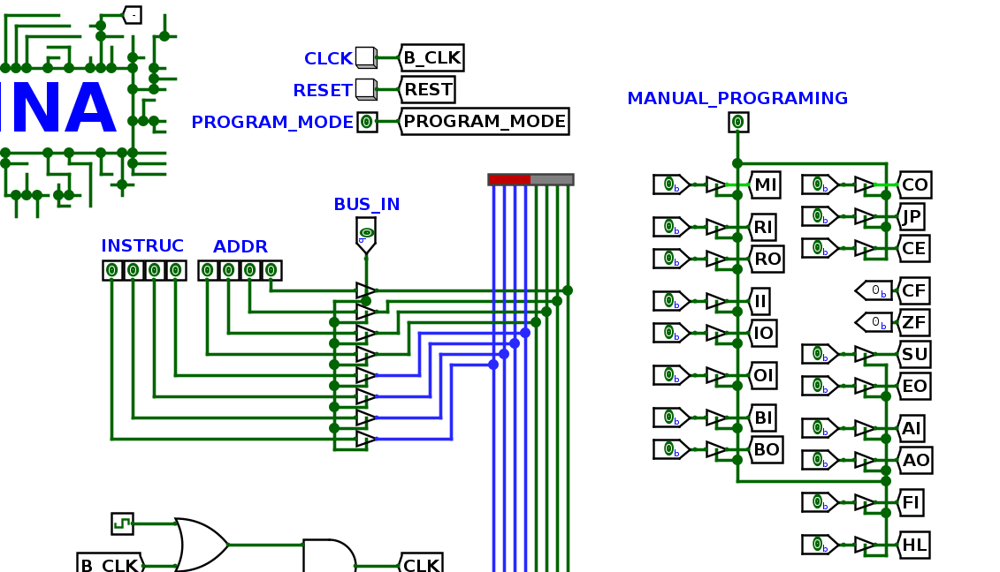

Ponemos en el ADDR la dirección de memoria de la 1º instrucción:

0000 0000, BUS_IN, MI, CLOCK

Y cuando estamos en la dirección 0.

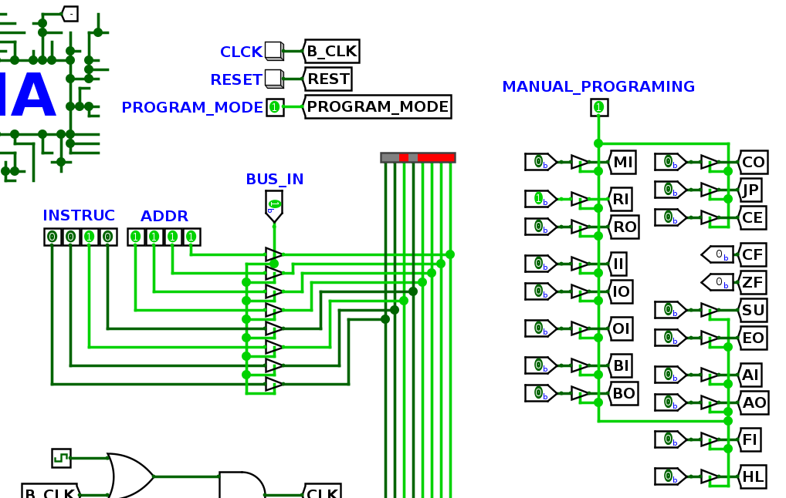

0010 1111, BUS_IN, RI, CLOCK

Y así con las instrucciones restantes, hasta que necesitemos introducir las variables necesarias como la dirección 15 que guarda un 2.

0000 1111, BUS_IN, MI, CLOCK

0000 0010, BUS_IN, RI, CLOCK

#### Compilador

Otra vez hacemos el programa usando los mnemónicos de la [tabla de instrucciones](https://docs.google.com/spreadsheets/d/1ntU3Rf7l5LElHSgGCQE4OmPOD4lz0emifyxvnIvVKok/edit#gid=0) y usando el archivo `compilador.py` ponemos los mnemónicos aquí:

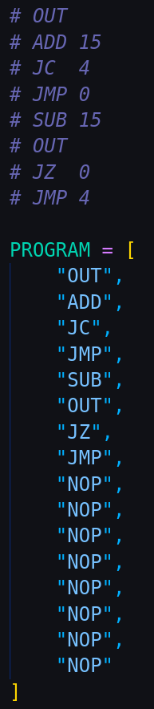

Y las direcciones de las instrucciones aquí:

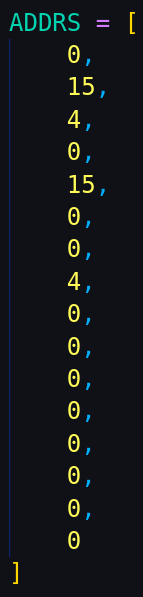

Sí, el programa necesita alguna variable como el 1 de la dirección 15, se pone aquí:

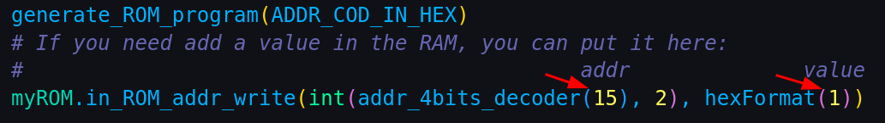

Ejecutamos el `compilador.py` y nos genera el archivo ROM correspondiente al programa, ahora solo habría que cargar el archivo en la RAM, dándole click derecho en sobre la RAM y eligiendo la ROM que cargar.

Ya lo sé, no es muy cómodo, pero el proyecto ya se está alargando demasiado y no me da para desarrollar una lectura de fichero.

Independientemente del método, al final hay que entrar en la pestaña Simulate y activar el auto-click.

## Agradecimientos y fuentes

* Fuente principal del proyecto, tanto por la parte teórica y práctica: [Ben Eater](https://twitter.com/ben_eater)
* Punto de referencia principal a la hora de diseñar los componentes en logisim-evolution: [Leonardo Berardino](https://github.com/leonicolas/computer-8bits)
* Como usar las puertas lógicas: [Karl Rombauts](https://medium.com/@karlrombauts/building-an-8-bit-computer-in-logisim-part-1-building-blocks-a4f1e5ea0d03)
* Contexto de otro proyecto: [spel3o](https://www.instructables.com/How-to-Build-an-8-Bit-Computer)
* Contexto de otro proyecto: [eddiewastaken](https://github.com/eddiewastaken/logisim-discrete-CPU)
