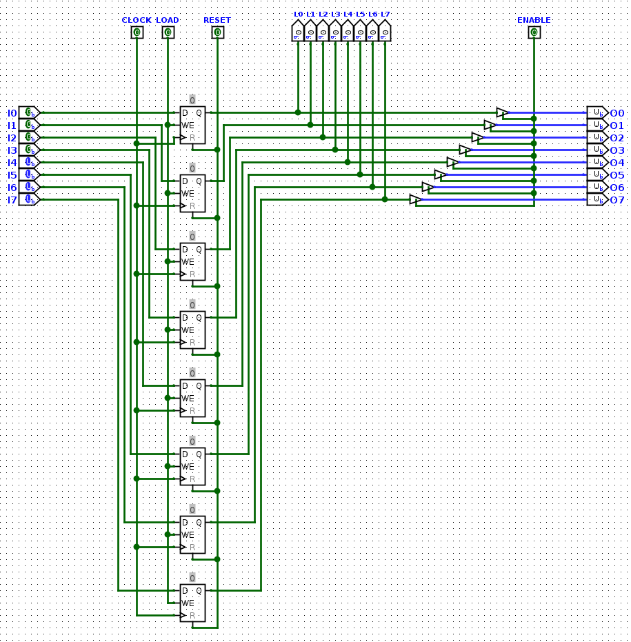
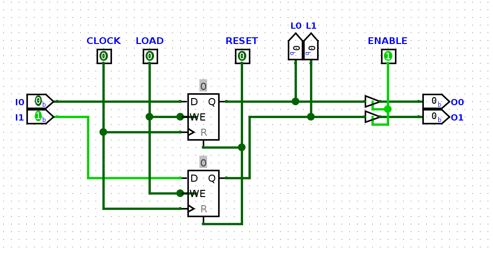

# MARINA


Este proyecto trata sobre como crear un ordenador de 8bits, que cumpla los requisitos de una máquina de turing:

* Leer/Escribir caracteres de una memoria
* Poder moverse por esa memoria
* Actuar en base a unos estados definidos

Una vez nuestro ordenador cumpla todos estos requisitos, estaremos seguros de que podra ejecutar cualquier algoritmo de computación.

Todo esto inspirado por la serie de videos de Ben Eater y contado por mi.

## Problema

Queremos hacer un ordenador así que necesitaremos resolver estas cuestiones:

1. ¿Dónde lo vamos a montar?
2. ¿Qué diseño tendra el circuito?
3. ¿Cuál es la base teorica detras de los ordenadores?
4. ¿Qué componentes necesitamos para la parte practica?
5. ¿Cómo se programa?

## Soluciones

### 1º Cuestión:

Para crear el circuito de nuestro ordenador usaremos un programa de simulación de circuitos, en este caso yo he elegido logisim-evolution, pero se puede utilizar otro si lo quereis.

### 2º Cuestión:

A la hora de elegir que forma tendra el circuito se habren una infinidad de diseños, pero en lo personal prefiero usar uno basado en un BUS. Más concretamente el patrón SAP.


### 3º Cuestión:

Estamos siguiendo los pasos para crear un ordenador, pero. ¿Qué es un ordenador?, pues segun wikipedia es: `una máquina electrónica digital programable que ejecuta una serie de comandos para procesar los datos de entrada, obteniendo convenientemente información que posteriormente se envía a las unidades de salida`. Y eso es cierto, pero lo que yo quiero es la definición de su modelo teorico fundamental, la máquina de Turing.

#### ¿Qué es la máquina de Turing?

Es un dispositivo que manipula símbolos sobre una tira de cinta de acuerdo con una tabla de reglas.


Un ejemplo visual con una tabla sencilla, para que se entienda mejor:


Y ahora con una tabla más compleja:


Simple ¿no?, pues solo con estas mecanicas tan cencillas se puede ejecutar cualquier algoritmo de computación. Y la verdad, suena a que es mentira o imposible, pero no lo es:

En terminos generales lo que hace la maquina es leer datos de una memoria y actuar en base a ellos siguiendo unas instrucciones predefinidas. ¿No os suena familiar?, es como programar un ordenador, este tambien manipula una memoria siguiendo unas instrucciones/estados que le hemos dado.

Ahora con todo este contexto podemos decir que:

* Sabemos que es y que hace la máquina de Turing
* Que un ordenador moderno no es más que una máquina de Turing extremadamente compleja que funciona con circuitos electronicos

### 4º Cuestión:

Ahora para llevar acabo su construcción necesitaremos los siguientes componentes:

#### `CLOCK`

Manda una señal para sincronizar a todos los componentes del ordenador.


#### `PROGRAM COUNTER`

Es un registro que guarda un número que puede incrementar y decrementar, para moverse por las direcciones de la memoria.


#### `MAR`

Es el registro de direccion de la memoria, almacena un número de 4bits y lo decodifica en 16  direcciones de memoria posibles. Para usarlo como dirección actual de la memoria.


#### `RAM`

Es la memoria principal del ordenador, guarda los datos/instrucciones que ejecuta el ordenador.


#### `REGISTRO A`

Almacena el número al que la ALU suma o resta otro número.




#### `REGISTRO B`

Almacena el número que la ALU suma o resta al REGISTRO A.


#### `ALU`

Es la encargada de hacer las operaciones aritmeticas(+,-), con los REGISTROS A y B.


#### `FLAGS REGISTER`

Es el registro que almacena el estado de la ultima operación de la ALU, si el resultado anterior acarreo un 1 activa la CARRING FLAG o si el resultado fue 0 activa la ZERO FLAG.




#### `REGISTRO DE INSTRUCCIONES`

Es el regisro que guarda la instruccion a ejecutar, para pasarsela al decodificador de instrucciones.


#### `DECODIFICADOR DE INSTRUCCIONES`

Es el encargado de decodificar las instrucciones programadas en la RAM para que el ordenador ejecute las acciones necesarias para que esa instrucción se lleve a cabo.


#### `BUS`

Son unos cables a los que se le conectan todos los componentes del ordenador, para comunicarse entre si.


### 5º Cuestión:

Vale ahora sí, la pieza final para entender como funciona un ordenador es entender cómo es que es programable, porque al fin y al cabo ¿cómo hacemos que el ordenador ejecute las instrucciones que le damos?. Por ejemplo, un programa que suma 2 más 2 y muestra el resultado:

```
LDA 15
ADD 15
OUT
```

Lo que he hecho aquí es cargar en el registro A lo que halla en la dirección de memoria 15, en este caso un 2, despues le he sumado al registro A otra vez el valor de la dirección de memoria 15 y he mostrado el resultado.

#### ¿CÓMO?, pues asi:

Cogemos y por cada instrucción que pueda interpretar el ordenador, la rompemos en acciones que pueden hacer los componentes ordenador, que son estas:

HL CE CO JP AI AO EO SU BI BO FI MI RI RO II IO	OI

Estos son los micro codigos con los que nos referimos a acciones como:

* HL: Para el reloj
* AI: Meter en el registro A lo que haya en el BUS
* CO: Volcar lo que tiene el PC en el BUS

Vale, pues vamos a desmontar la siguiente instrucción.

##### ```LDA 15```

1. CO MI
2. RO II
3. CE
4. IO MI
5. RO AI

CO volcamos en el BUS la dirección actual del PC y lo metemo en el MAR para ir a esa dirección de memoria.

RO volcamos lo que hay en esa posición de la RAM y lo metemos en el registro de instrucciones.

CE el PC aumenta el contador, para que la proxima vez que hagamos un CO se la siguiente dirección de memoria.

IO volcamos lo que hay en el registro de instucciones en el BUS, pero este registro solo saca los 4bits que corresponde a la dirección 15 indicada en la instrucción. MI para ir a esa dirección de memoria.

RO sacamos el valor que haya en esa posición de la RAM y lo metemos en el registro A.

Y así con cada instrucción que tenga nuestra máquina. Aquí podeis ver las instrucciones con sus microcodigos que tiene MARINA. Hay tambien vereis que los micro códigos se dividen tambien en steps(pasos), porque hay micro códigos que no se pueden ejecutar a la vez o no interesa hacerlo, así que rompemos la ejecución de los micro códigos en 8 pasos.

De esto se encarga el decodificador de instrucciones:


### Generación de las ROMs:

Pues lo que necesitamos para que el ordenador sepa que micro códigos ejecutar y cuando utilizaremos una ROM. Usaremos las instrucciones como dirección y como datos en esa dirección que micro códigos tenemos que ejecutar. Cuando le llegue una instrucción al decodificador de instrucciones, este mirara en la ROM, segun que instrucción y paso es, sabra que micro código tiene que ejecutar.

Podemos generar la ROM con este archivo `instruc_decoder_rom_generator.py`.

### ¿Cómo usar a MARINA?

Para poder ejecutar un programas lo unico que hay que hacer es cargar en la RAM las instrucciones, entrar en la pestaña Simulate y activar el auto-click.

